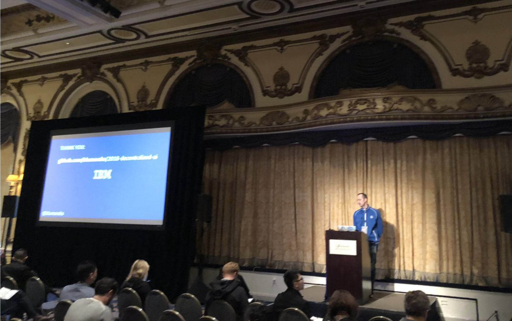

# 2018 Decentralized AI in San Francisco
Some links and code for Decentralized AI

*The Decentralized AI conference was full - with great sessions from major players and niche contributors*

1. In order to use Watson AI services (there is a free tier!) please [signup for IBM Cloud here](http://bluemix.net)
2. voice ui for Unity:  https://github.com/IBM/vr-speech-sandbox-vive
3. Watson Chatbot for Mobile starter kit - https://console.bluemix.net/developer/mobile/starter-kits
4. Watson Visual Recognition and Drones: https://www.ibm.com/blogs/bluemix/2016/08/watson-visual-recognition-and-drones/
5. Watson Training/Tailing: https://www.ibm.com/blogs/bluemix/2017/03/sharpen-watson-visual-recognition-results/
6. You are invited to Index conference: https://developer.ibm.com/indexconf

## Voice UI for VR/AR applications
It is great to use your own voice to issue commands when immersed in the VR/AR environments. The AI interprets the commands from Speech to Text services and provides actions. One of the provided examples here [voice ui for Unity](https://github.com/IBM/vr-speech-sandbox-vive) has been used in Ubisoft's Star Trek Bridge Crew VR game. In the game you can issue commands to the AI based crew, and the system responds to you with the prompt actions. It makes the interaction in the game so much more enjoyable when you can say with your own voice - *Prepare for Warp Speed*, and *Engage*. 

## Chatbots for Mobile
You can easily leverage the example from documentation - [Build a voice-enabled Android chatbot]( https://console.bluemix.net/docs/tutorials/android-watson-chatbot.html#build-a-voice-enabled-android-chatbot). What matters a lot it is that the interface is also voice enabled with both Text to Speech and Speech to Text Watson services used.

*The Android Watson voice enabled chatbot app architecture - an example from IBM Cloud documentation*

## Visual Recognition in Drones
Using drones with AI was intriguing early on. You can read more about using drones to detect hail inflicted damages on the roofs of the houses under the insurance - so AI enabled drones are the ideal tool for the insurance industry to calculate the amount of the claim to be paid to the customer.

Please watch this video showing the entire business proess used for that process: https://youtu.be/Nv4i9rxGp_s

## Training for Visual Recognition - breaking a large file into tiles
Fast training for the Watson Visual Recognition is possible through [the Watson Visual Recognition command line tool - check it here](https://developer.ibm.com/dwblog/2017/command-line-tools-watson-visual-recognition/). The code to the npm tool is here: https://www.npmjs.com/package/watson-visual-recognition-utils

[In addition to the regular training you might want to use the tiling tool - here](https://github.com/IBM-Cloud/Visual-Recognition-Tile-Localization)

If you like this blog git post - give me a star!

Follow me on Twitter: @blumareks
